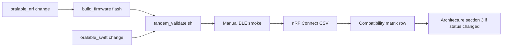
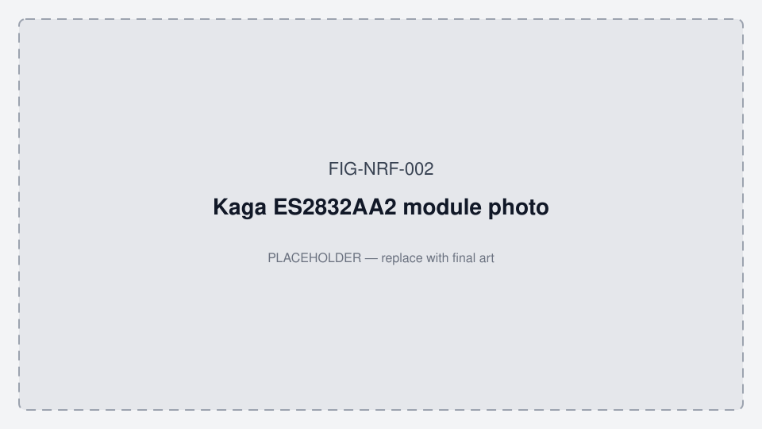
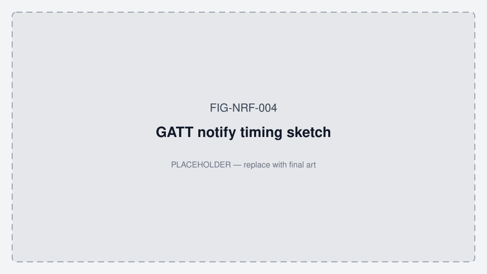

# Oralable Development Workflow (firmware + iOS)

**App working diagrams:** [MOBILE_APP_FLOWS.md §2](../../oralable_swift/docs/MOBILE_APP_FLOWS.md#2-how-the-patient-app-works--phase-0)

Keeps `oralable_nrf` and `oralable_swift` synchronized. **Doc index:** [README.md](./README.md) · **Product:** [ORALABLE_MARKET_LANDSCAPE.md](./ORALABLE_MARKET_LANDSCAPE.md) · **Figures:** [FIGURES.md](./FIGURES.md)

**System architecture & validation matrix:** [cursor_oralable/docs/ORALABLE_SYSTEM_ARCHITECTURE.md](../../cursor_oralable/docs/ORALABLE_SYSTEM_ARCHITECTURE.md) (truth registry, §3 status, GATT detail). **This file** covers tandem workflow, smoke checklist, and compatibility matrix only.





*Figure FIG-NRF-002 — Kaga ES2832AA2 module photo (placeholder).*



*Figure FIG-NRF-004 — GATT notify timing sketch (placeholder).*

---

## Goals

- Develop `oralable_nrf` and `oralable_swift` in parallel.
- Validate compatibility after each meaningful change.
- Record known-good firmware/iOS commit pairs for quick rollback.
- **Lock product truth** per architecture §1 before changing `chrsts`, LED policy, or status layout.

## Source of truth

| Item | Path |
|------|------|
| Firmware | `~/work/oralable_nrf` |
| iOS | `~/work/oralable_swift` |
| System hub | `cursor_oralable/docs/ORALABLE_SYSTEM_ARCHITECTURE.md` |
| Validation script | `oralable_nrf/scripts/tandem_validate.sh` |
| Flash + RTT | `oralable_nrf/scripts/flash_and_rtt.sh` |
| OTA | [OTA_DEVICE_MANAGER.md](./OTA_DEVICE_MANAGER.md) |
| nRF Connect rule | `oralable_nrf/.cursor/rules/nrf-connect-validation.mdc` |

### IDE / clangd (Cursor · VS Code)

Red squiggles on Zephyr includes (`app/drivers/…`, `uint8_t`, `LOG_*`) are usually **missing compile DB**, not real build failures.

| File | Role |
|------|------|
| `.clangd` | Points clangd at `build_pcb00003_test` |
| `compile_commands.json` | Symlink → that build’s DB |
| `.vscode/settings.json` | `C_Cpp` + clangd compile-commands dir |

After a fresh clone or SDK bump, regenerate then reload the window:

```bash
west build -b pcb00003/nrf52832 app -d build_pcb00003_test
# If you use another -d dir, update .clangd CompilationDatabase + the symlink
```

Command Palette → **Developer: Reload Window** (or restart clangd) so diagnostics refresh.

**Driver source of truth:** out-of-tree sensors live under repo-root `drivers/sensor/` (e.g. `drivers/sensor/lis2dtw12/lis2dtw12.c`), not under `app/drivers/`.

---

## Validation loop

1. Make changes in firmware and/or iOS.
2. Run tandem validation:

   ```bash
   cd ~/work/oralable_nrf
   ./scripts/tandem_validate.sh
   ```

3. Complete manual BLE smoke checks (below).
4. Export nRF Connect CSV for charger/off-pad if touching `chrsts` or LEDs.
5. Add a row to **Compatibility matrix** (bottom of this doc).
6. Update architecture **§3** if acceptance status changed.
7. Commit in each repo and push.

---

## Manual smoke checklist (TGM / firmware ≥ 1.0.63; **Gen1 target 1.0.84**)

iOS `FirmwareGate` minimum: **1.0.63** · recommend **1.0.84**. **Ed/Pedro Phase 0 kits:** flash **1.0.84**. App **4.3.3** (build **5**). Record actual `3A0FF006` after flash. See [VERSION_ALIGNMENT.md](../../cursor_oralable/docs/data_room/VERSION_ALIGNMENT.md).

**Hardware (Gen1 pilot):** BOM **REV8** · PCB **REV10** · Kaga **ES2832AA2** · charge only in the **Oralable magnetic case** (not WPC Qi). See [PRODUCT_ROADMAP.md](../../cursor_oralable/docs/PRODUCT_ROADMAP.md) · [COST_AND_TIMELINE.md](../../cursor_oralable/docs/data_room/COST_AND_TIMELINE.md) (Stage A now–2027; Stage B later).

- [ ] **Oralable magnetic charging case** + optional J-Link: boots and advertises as **Oralable** (not a wired contact dock; not a phone Qi pad).
- [ ] Battery-only: remains alive ≥ 180s (optional soak).
- [ ] **Device Manager** or **nRF Connect**: TGM `3A0FF000` + SMP services discovered.
- [ ] Read firmware `3A0FF006` (workspace / target: **`1.0.84`**).
- [ ] GATT includes **`3A0FF009`** (status), **`3A0FF00A`** (fw log), **`3A0FF00B`** (config write), **`3A0FF00C`** (config state) when build ≥ 1.0.37.
- [ ] **No BLE:** PPG/ACC off; status green on pad / dark off pad.
- [ ] **BLE connected:** PPG/ACC after CCC enable **without** a worn write; `worn` status may stay 0. Export nRF CSV if comparing to iOS. *(Cheek / Protocol B = Phase 1+ only.)*
- [ ] **Charger path (if changed):** notify `004` + `009` only — off case 60 s → on Oralable case 60 s → off case; byte0 should toggle or use manual mode 1 (architecture §3.3 S2).
- [ ] iOS: Settings → Developer → **Dump firmware diagnostics** → export nRF-style CSV.
- [ ] iOS app: connect → auto-record; optional CloudKit share smoke.
- [ ] OTA: `dfu_application.zip` after one-time `merged.hex` flash.

**Notes:** RTT optional for pass/fail. Primary acceptance (Phase 0): stable temple BLE ≥ 2 min, honest state, HR/SpO₂ quality gates. **Do not** treat solid red on the Oralable case as proof of full SOC — case voltage can inflate ADC (architecture §3.2).

---

## LED indicators & battery (pcb00003)

Off-body status uses the **MAXM86161 PPG LEDs** (green / red channels), not a separate status LED. Implementation: `app/src/battery_led_indicator.c`.

Worn detection **1.0.82+:** IR pulse (AC/DC). Die temperature is logged only. **1.0.80+:** PPG/ACC follow the BLE link, not worn. While BLE is connected, status LEDs stay off; optical emitters are PPG-only (red/IR while PPG notify is on).

### Target UX (FW ≥ 1.0.73 — sense on BLE; green on pad only)

**1.0.73:** STAT on-pad wins over leftover Dual A / nRF Connect user mode 3 (worn). After a Mac Dual A run, seating on the Oralable case still shows flash/solid green with no phone.

**1.0.74:** Pad-wins does **not** clear mode 3 while PPG or ACC CCC is on (live Mac Protocol A / Dual A). Leftover worn still clears on the case with no stream.

**1.0.75:** Mode 3 (force worn) is refused below the soft floor (3610 mV / 5%). A live mode-3 session that sags under the floor clears worn **and** mode 3 so Mac cannot re-force full PPG on a flat cell.

**1.0.76:** If PPG/ACC notifies stall ~4 s while CCC is on, force-recover the BLE link (drop zombie conn, zero PPG LEDs, restart advertising). If `.recycled` does not run within 2 s after disconnect, start advertising anyway. Fixes solid red + silent clip after a Mac Protocol A drop.

**1.0.77:** After an explicit mode-3 write, STAT pad-wins is ignored for 5 s (or until PPG/ACC CCC). Stall recover is PPG-specific: ACC/battery success no longer keeps a dead PPG stream alive. If every subscribed PPG/ACC/battery/FwLog notify is silent ~4 s while PPG or ACC CCC is on, recover. Fw-log: `ppg_start skip` / `ppg_start ok`. Mac Protocol A staggers CCC battery → status → FwLog → PPG → ACC (nRF Connect / iOS order).

**1.0.78:** Protocol A power profile only. ADC sample on PPG start (`fw: bat under_load`). If cached or under-load mV &lt; 3900, dim worn LEDs (IR 64 / red 16). Soft floor is skipped for 6 min after explicit mode 3. Chemical protect at 2.8 V is unchanged.

**1.0.79:** Sensing red/IR only while PPG notifies are live (&lt;2 s). A zombie “connected” link with no notifies is force-recovered so advertising restarts. Off-link: leftover red is cleared, then green on pad / dark off pad.

**1.0.80:** PPG/ACC start whenever a central is connected and CCC is on. Worn is status only (temp / mode 3). No MCU shutdown at 5%.

**1.0.81:** Below **5% / 3.61 V**, PPG and ACC stop even if BLE is still up. MCU, advertising, and charge stay on. Stream resumes when the gauge is back above the floor and CCC is still on. No MCU shutdown at 5%.

**1.0.82:** Automatic `worn` follows **IR pulse** (AC/DC for ≥2.5 s; 20 s hold through a clench), not die temperature. MAM still streams raw red/green/IR + ACC. HR/SpO₂ stay on the phone/Mac. Mode 3 still forces worn. On-dock still `worn=0`.

**1.0.84:** PPG/ACC GATT notifies are high priority; FwLog is low. Stall recover drops a zombie link when **samples** go silent **or** when no PPG notify succeeds for ~4 s (AFE can still pulse with no central). STAT charging/taper owns the LEDs in that idle case: zero red/IR, green, clear leftover mode 3, restart advertising. A live Protocol A session keeps sensing LEDs because PPG notifies succeed. Mac Protocol A does **not** subscribe FwLog unless `--fw-log`. **Desk/bench abandon:** if `worn=0`, PPG is still sensing, and ACC shows no significant motion for **10 minutes**, force-recover and re-advertise. Overnight on-temple (`worn=1`) is not dropped for stillness.

| Context | Condition | Target LED | Notes |
|---------|-----------|------------|--------|
| **BLE connected** | Any dock / worn | **Off** (no status) | Red/IR while PPG CCC is on |
| **On Oralable case, no BLE** | STAT blinking | **Flash green** | `charge_active=1` |
| **On Oralable case, no BLE** | STAT taper / hold | **Solid green** | Taper / hold — not 4.2 V full |
| **Off case, no BLE** | Any SOC | **Off** | No status green off the pad |

**SOC clamp:** `BATTERY_LED_FULL_THRESHOLD_PCT` = **80** (`battery_led_indicator.h`) — used to cap inflated on-pad %; not an off-pad LED threshold.

**iOS mirror:** `DeviceStatusLEDRepresentation` in OralableCore — rendered on **VitalsDeviceStatusCard** (app **4.3.3+**).

**Percent mapping (FW ≥ 1.0.68):** CG-320B **user gauge** — 4.35 V = 100%, **3.61 V = remapped 0%** (operational empty; old chemistry curve used 3.0 V = 0%). Status byte 3 uses this map. Raw mV still on `3A0FF004`.

**Legacy (FW ≤ 1.0.62):** green flash on charger, red off case — deprecated.

### What users often see (FW **1.0.72**)

| Observation | Likely meaning |
|-------------|----------------|
| Flash **green** on Oralable case (no BLE) | STAT blinking — charging (`charge_active=1`) |
| **Solid green** on Oralable case (no BLE) | STAT taper / hold (`charge_active=0`; not 4.2 V full) |
| No status LED off case (no BLE) | Expected — green is pad-only |
| No status LED while nRF Connect / app is linked | Expected — optics are PPG-only |
| Red/IR while PPG CCC is on | PPG sensing drive, not a status colour |

### BLE status characteristic (`3A0FF009`)

**FW ≥ 1.0.47:** five-byte notify/read (also updated on charge/worn/battery changes).

| Byte | Field |
|------|--------|
| 0 | `on_dock` — 0 off Oralable case, 1 on charger (`chrsts` / LTC4124 STAT; **FW ≥ 1.0.70** uses STAT blink/taper activity) |
| 1 | `worn` — 0 off-body, 1 on-body (**1.0.82+:** IR pulse; mode 3 still forces 1). Die temp is not used. |
| 2 | `device_state` — 0 off charger / 1 on charger / 2 worn |
| 3 | `battery_pct` — 0–100 (voltage estimate; inflated on pad is normal) |
| 4 | `charge_active` — **1.0.70+:** 1 while STAT is **blinking** (charging); 0 on STAT **taper** (steady assert) while still `on_dock=1`. Manual mode 1 may also set this from mV rise. |

**FW 1.0.36–1.0.46 (legacy):** four bytes (no `charge_active`; byte 0 named `charging` in older docs).

**Firmware log / config (≥ 1.0.37):**

| UUID | Role |
|------|------|
| `3A0FF00A` | Notify — UTF-8 firmware log lines (`fw: snap …`, `fw: stats …`) |
| `3A0FF00B` | Write — TLV config opcodes (see iOS `FirmwareConfigOpcode`) |
| `3A0FF00C` | Read/notify — applied config state |

**iOS:** Settings → Developer → **Dump firmware diagnostics** (snapshot + export nRF CSV). Connect uses staggered CCC per architecture §10.

**Firmware version:** read `3A0FF006` (UTF-8 string).

### Worn gating & streaming

- **No BLE:** PPG/ACC hardware stopped (FIFO IRQ / ACC off). Advertising and charge LEDs continue.
- **BLE connected (1.0.80+):** PPG/ACC start after CCC enable. `worn=0` does **not** skip the stream.
- **Worn (1.0.82+):** Automatic = IR AC pulse present (not MCU die heat). Phone computes HR (green/IR) and SpO₂ (red+IR). Mode 3 still forces `worn=1`.
- **Below 5% (1.0.81+):** PPG/ACC off even while linked. MCU does not shut down. Charge on the Oralable case still works.
- **Connect probe:** Disabled in vitals builds (`CONFIG_TGM_CONNECT_PROBE_DURATION_S=0`). Older FW: 10 s dim green probe when `worn=0`.
- **Sensing LEDs:** wait for PPG CCC (no FIFO / red/IR before a subscriber).
- **BLE disconnect (1.0.71):** `ppg_stop()` + `acc_stop()` — AFE power-save, not IRQ-only. Status green uses `ppg_ensure_awake_status_leds` (IRQ off). Resume after reconnect + CCC. IR-pulse worn clears when the stream stops.
- **PPG INT:** MAXM86161 open-drain is **ACTIVE_LOW** — use DT `int-gpios` (`gpio_pin_configure_dt` / `gpio_pin_interrupt_configure_dt`) so `EDGE_TO_ACTIVE` is falling.
- **Advertising (Nordic NCS ≥ 3.0):** restart connectable advertising from the connection **`.recycled`** callback via `k_work` — not from `disconnected`.
- **Bench trap (pre-1.0.82):** holding the clip warmed the MCU and falsely set `worn=1`. **1.0.82+:** bench with no IR pulse stays `worn=0`.

**RTT connect line (example):** `BLE link up: charging=1 worn=0 state=1 bat=54% die=22.50 C probe=10s`

### Battery ADC policy

- Plausible cell window: **2000–5000 mV** after divider scaling.
- Implausible raw pin mV or failed scaling fallbacks: **discard** the sample (do not update `battery_value`, history, BLE notify, or charge detector).
- Do **not** clamp out-of-range candidates into 2000/5000 mV and publish — that invents a voltage.

### Soft floor (remapped 0%) and low-voltage protection

- **Soft floor (FW ≥ 1.0.68):** when cell **&lt; 3.61 V** (or remapped % &lt; 5) — **1.0.81+:** stop PPG/ACC even if BLE is connected. Keep MCU, advertising, charge LEDs. Does **not** cold-reboot.
- **Chemical protect:** If `CONFIG_BATTERY_CRITICAL_LOW_SHUTDOWN=y` (see root `prj.conf`), firmware **cold-reboots** when smoothed battery **&lt; 2.8 V** for three consecutive samples.

**BATEN (P0.10):** boost latch must stay HIGH — `SYS_INIT` + main loop re-assert (`battery.c`, `main.c`).

### Troubleshooting quick checks

1. Flash + RTT: `./scripts/flash_and_rtt.sh` — look for `Battery: XXXXmV -> YY%` and `Initial charging state`.
2. nRF Connect: read `3A0FF006` + `3A0FF009`, enable **battery (`004`)** + **status (`009`)** notifies for a 2 min soak off case, then on Oralable case.
3. Judge SOC and LED behavior **off the Oralable case** after a case soak (not only while on case).
4. **FW ≥ 1.0.70 CHRSTS (LTC4124 STAT) — not “broken”:** STAT **blinks while charging** and goes **steady assert** when charge current tapers (“almost full”, not necessarily 4.2 V). Firmware uses `CONFIG_CHRSTS_STAT_ACTIVITY` (edge count → `charge_active`, steady assert → on-pad taper, steady inactive → undock). Manual modes 1/2/3 still override auto. Prefer **Oralable case + USB-C** only (not MagSafe/Qi).
5. nRF Connect / RTT gate for 1.0.84: after Dual A (mode 3), **disconnect** then seat on Oralable case with no central → green returns (STAT pad wins). A leftover zombie CCC on the pad must also go green and advertise (~4 s). While PPG notifies are succeeding (live session), pad-wins must **not** clear worn. Status `on_dock=1` + `charge_active=1` (flash) or `charge_active=0` (solid taper). Connect → LED off. Lift off → LED off.
6. If **Oralable** missing in scan after disconnect: wait for connection **recycle**; `ble.c` restarts advertising from `.recycled` via `k_work` (not from the disconnect callback). Soft `ble_ensure_advertising()` only if adv is off.
7. **1.0.82 stream + worn (phone Bluetooth off):** nRF Connect → read `3A0FF006` (**1.0.82**) → enable CCC battery → status → FwLog → PPG → ACC. Above 5%: `fw: ppg_start ok` with `worn=0` until IR pulse. Temple: `fw: ir_pulse worn=1` after ~2.5 s. Below 5%: `fw: floor sensors off` / `ppg_start skip … floor=1`; BLE stays up.
8. **Stuck solid red + not advertising after Mac Protocol A:** Seat on Oralable case. **1.0.84+** should go green and advertise within ~4 s (pad wins idle link). If still red and invisible, SWD flash **1.0.84**. Phone Bluetooth off before Protocol A. Mac: no `--fw-log`.

### Related source files

| Topic | Path |
|-------|------|
| LED logic | `app/src/battery_led_indicator.c` |
| Battery ADC | `app/src/battery.c` |
| Charge detect | `app/src/main.c`, `app/src/charge_detector.c` |
| Worn / state | `app/src/tgm_service.c` (`ir_pulse_feed`); mode 3 in `main.c` |
| Status notify | `app/src/tgm_service.c` (`tgm_service_send_status_notify`) |
| FW log / config GATT | `app/src/tgm_service.c` (`3A0FF00A`–`00C`) |
| Connect probe | `app/src/tgm_service.c`, `CONFIG_TGM_CONNECT_PROBE_DURATION_S` |

---

## Compatibility matrix

Record known-good pairs after `tandem_validate.sh` + manual smoke. **Live validation status:** architecture doc §3.

| Date (UTC) | Firmware | FW commit | iOS commit | FW version | Validation | Manual smoke | Result | Notes |
|---|---|---|---|---|---|---|---|---|
| 2026-05-28 | oralable_nrf | c617f81 | 547c2b7 | (pre-1.0.36 gate) | tandem_validate.sh | Build checks | PASS | Baseline battery+BLE |
| 2026-06-07 | oralable_nrf | (workspace) | (workspace) | **1.0.36-nrfconnect** | tandem + nRF Connect CSV | TGM GATT, worn gate | PASS | nRF-aligned CCC order |
| 2026-06-07 | oralable_nrf | `4210e97` | `6097a0a` | **1.0.37-nrfconnect** | build + flash smoke | 00A/B/C diagnostics, connect probe | PASS | iOS Developer dump + fw log |
| 2026-06-07 | oralable_nrf | (workspace) | (workspace) | **1.0.51-nrfconnect** | nRF CSV logs 33–36 | chrsts byte0, LED policy | **PARTIAL** | See architecture §3.2–3.3; chrsts BROKEN on Oralable case |
| 2026-07-16 | oralable_nrf | (workspace) | (workspace) | **1.0.67-nrfconnect** (`app/VERSION`); kits still **1.0.66** hex | nRF Connect TBD | Bugbot + Nordic/Apple; no `CONFIG_BT_DFU_SMP`; iOS CCC timeouts | **PARTIAL** | §3b S1–S4 before tag |
| 2026-08-30 | oralable_nrf | (workspace) | (workspace) | **1.0.84** | hex + OTA zip archived | Pad/zombie recover + desk abandon | **TARGET** | [FIRMWARE_1.0.84_FLASH.md](../../cursor_oralable/docs/data_room/FIRMWARE_1.0.84_FLASH.md) |
| 2026-08-27 | oralable_nrf | (workspace) | (workspace) | **1.0.82** | packaged hex + OTA zip | Automatic worn = IR pulse | **PRIOR** | Keep for OTA rollback |
| 2026-08-14 | oralable_nrf | (workspace) | (workspace) | **1.0.71** | nRF Connect TBD | sense-on-BLE; green charge LEDs | — | Superseded by 1.0.72 (off-pad dark) |
| 2026-07-24 | oralable_nrf | (workspace) | (workspace) | **1.0.70** | docs stamp sync | — | — | App **4.3.3** milestone; [VERSION_ALIGNMENT](../../cursor_oralable/docs/data_room/VERSION_ALIGNMENT.md) |
| 2026-07-22 | oralable_nrf | (workspace) | (workspace) | **1.0.70** | packaged hex + docs aligned · RTT gate TBD | CHRSTS STAT activity (blink=charge) | **SHIP** | App **4.3.2**; [VERSION_ALIGNMENT](../../cursor_oralable/docs/data_room/VERSION_ALIGNMENT.md) |

### How to add a row

```bash
cd ~/work/oralable_nrf && git rev-parse --short HEAD
cd ~/work/oralable_swift && git rev-parse --short HEAD
```

*Last updated: 30 Aug 2026 (Gen1 target **1.0.84**; iOS **4.3.3** build **5** — [VERSION_ALIGNMENT.md](../../cursor_oralable/docs/data_room/VERSION_ALIGNMENT.md))*
