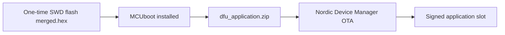
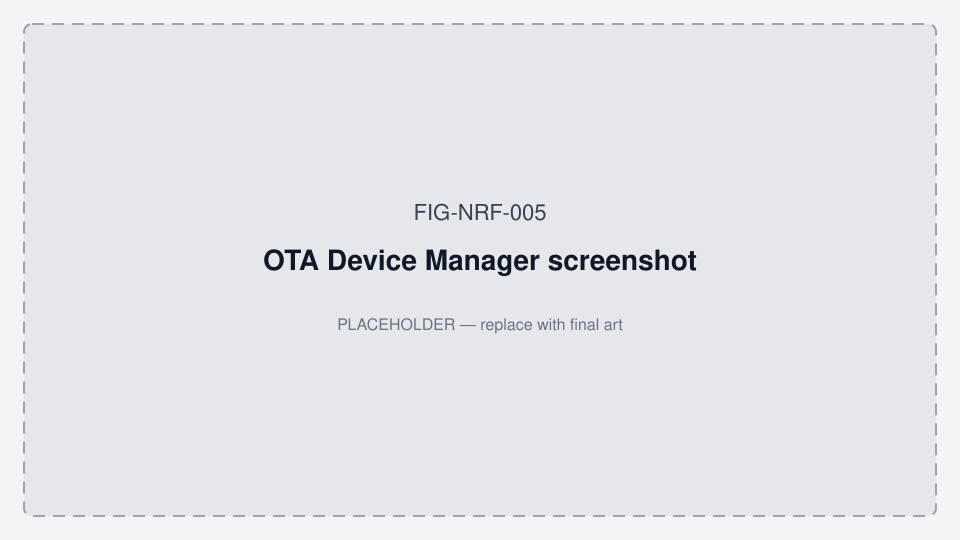

# OTA with Nordic Device Manager (iOS)

**Related:** [docs/README.md](./README.md) · [DEVELOPMENT.md](./DEVELOPMENT.md) · [ORALABLE_MARKET_LANDSCAPE.md](./ORALABLE_MARKET_LANDSCAPE.md) · [FIGURES.md](./FIGURES.md) · **App working diagrams:** [MOBILE_APP_FLOWS.md §2](../../oralable_swift/docs/MOBILE_APP_FLOWS.md#2-how-the-patient-app-works--phase-0)

Use the **Nordic Device Manager** iOS app for over-the-air firmware updates on pcb00003.
This firmware uses **mcumgr (SMP) over BLE** with **MCUboot** — not the legacy Nordic DFU protocol.





*Figure FIG-NRF-005 — OTA Device Manager screenshot (placeholder).*

## Apps

| App | Use for Oralable OTA? |
|-----|------------------------|
| **Nordic Device Manager** | Yes |
| nRF Connect (legacy DFU) | No |
| Oralable iOS app | No (no DFU UI today) |

## One-time setup (SWD)

OTA only works after MCUboot is installed on the device. Flash once over J-Link:

```bash
cd ~/work/oralable_nrf
./scripts/flash_and_rtt.sh
```

That builds with sysbuild and flashes `build_pcb00003/merged.hex` (MCUboot + signed application).

After this step, all subsequent updates can be OTA.

## Build artifacts

After `./scripts/build_firmware.sh`, use one of these files in Device Manager:

| Purpose | Path |
|---------|------|
| OTA zip (recommended) | `build_pcb00003/dfu_application.zip` |
| OTA signed bin | `build_pcb00003/app/zephyr/zephyr.signed.bin` |
| Convenience symlink | `build_pcb00003/app_update.bin` → signed bin |
| SWD first flash only | `build_pcb00003/merged.hex` |

**Packaged ship (1.0.82):** AirDrop `oralable_nrf/artifacts/oralable_1.0.82_pcb00003_dfu_application.zip` (copy also in `cursor_oralable/docs/data_room/firmware/`). Guide: [FIRMWARE_1.0.82_FLASH.md](../../cursor_oralable/docs/data_room/FIRMWARE_1.0.82_FLASH.md).

Rebuild before each OTA when firmware changes:

```bash
./scripts/build_firmware.sh
```

## OTA from iPhone (Nordic Device Manager)

1. Install **Nordic Device Manager** from the App Store.
2. Build firmware on your Mac (see above).
3. Transfer the update file to the iPhone (AirDrop, Files, iCloud, etc.).
   - Easiest: `dfu_application.zip`
   - Alternative: `app_update.bin`
4. Open Nordic Device Manager → scan → connect to **Oralable**.
5. Open **Firmware Upgrade** (DFU).
6. Select the `.zip` or `.bin` file.
7. Start the update and keep the phone close to the device until it reboots.

Device Manager runs the standard mcumgr flow: upload → test → reset → confirm.

## OTA from Mac (mcumgr CLI)

Same signed image, command-line alternative:

```bash
./scripts/update_firmware.sh --ota
```

Requires `mcumgr` in PATH (`pipx install mcumgr`).

## Firmware requirements (already enabled)

These Kconfig options are set in `app/prj.conf` and `app/sysbuild.conf`:

- `SB_CONFIG_BOOTLOADER_MCUBOOT=y` — MCUboot in sysbuild
- `CONFIG_NCS_SAMPLE_MCUMGR_BT_OTA_DFU=y` — NCS mcumgr BLE OTA sample helper (Academy Intermediate L9)
- `CONFIG_NCS_SAMPLE_MCUMGR_BT_OTA_DFU_SPEEDUP=y` — larger BLE buffers for faster FOTA
- Explicit MCUmgr stack (production-visible list alongside the sample helper):
  - `CONFIG_MCUMGR`, `CONFIG_NET_BUF`, `CONFIG_ZCBOR`, `CONFIG_CRC`
  - `CONFIG_IMG_MANAGER`, `CONFIG_STREAM_FLASH`, `CONFIG_FLASH_MAP`, `CONFIG_FLASH`
  - `CONFIG_MCUMGR_GRP_IMG`, `CONFIG_MCUMGR_GRP_OS`, `CONFIG_MCUMGR_GRP_OS_BOOTLOADER_INFO`
  - `CONFIG_MCUMGR_TRANSPORT_BT`, `CONFIG_MCUMGR_TRANSPORT_BT_REASSEMBLY`
  - `CONFIG_MCUMGR_TRANSPORT_BT_CONN_PARAM_CONTROL`
- `CONFIG_MCUMGR_TRANSPORT_BT_DYNAMIC_SVC_REGISTRATION=n` — SMP registered statically so Device Manager discovers it at connect time

**Not used:** `CONFIG_BT_DFU_SMP` — that is the **central** GATT DFU SMP *client* (Central SMP Client sample), not the peripheral OTA server path.

**Not enabled (pilot):** `CONFIG_MCUMGR_TRANSPORT_BT_PERM_RW_AUTHEN` — Nordic recommends for production once pairing UX exists; would require Device Manager bonding before OTA.

Signing uses ECDSA P256 (`SB_CONFIG_BOOT_SIGNATURE_TYPE_ECDSA_P256=y`) with
`bootloader/mcuboot/root-ec-p256.pem`.

## Troubleshooting

| Symptom | Likely cause | Fix |
|---------|--------------|-----|
| Device Manager connects but no DFU / upload fails | Device still on pre-MCUboot firmware | Run `./scripts/flash_and_rtt.sh` once |
| Oralable not in scan list | Not advertising, dead battery, or out of range | Charge device; after disconnect wait for host **recycle** (NCS `.recycled` restarts adv) |
| Upload stalls or disconnects mid-transfer | BLE link dropped | Stay close; retry; avoid heavy notify load during DFU |
| Update completes but old version runs | Image not confirmed after reboot | Retry OTA; check MCUboot slot swap in Device Manager image list |

## Related scripts

| Script | Role |
|--------|------|
| `scripts/build_firmware.sh` | Sysbuild: MCUboot + signed app + OTA artifacts |
| `scripts/flash_and_rtt.sh` | SWD flash `merged.hex` + RTT log |
| `scripts/update_firmware.sh --ota` | mcumgr BLE upload from Mac |
| `tools/mcumgr_dfu_pcb00003.sh` | Low-level mcumgr upload helper |
